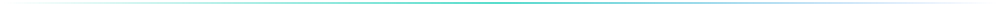
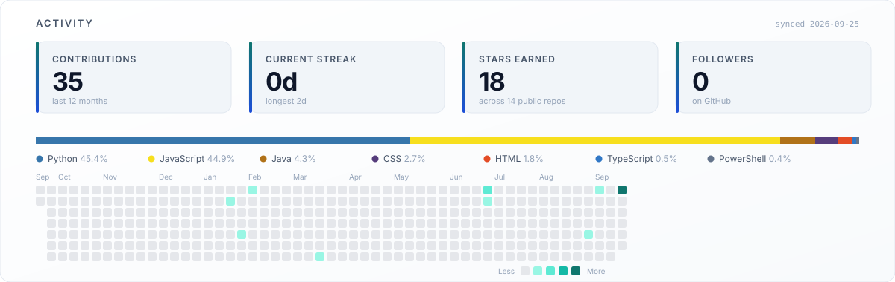

<picture>
  <source media="(prefers-color-scheme: dark)" srcset="assets/hero-dark.svg" />
  
</picture>

  I find the ways systems break, then build the tooling and hardened infrastructure that keep them from breaking again. 
  Currently focused on <strong>AI/LLM infrastructure</strong> with security designed in from the first commit.

  &nbsp;
  &nbsp;
  

## About

<table>
<tr>
<td width="33%" valign="top">

**Offensive security**

Web application pentesting, exploit development, and red-team assessments grounded in the OWASP Top 10 and CWE Top 25.

</td>
<td width="33%" valign="top">

**Secure engineering**

Full-stack systems in TypeScript, Python, Go, and Rust. Threat-modelled before the first line, tested and observable from day one.

</td>
<td width="33%" valign="top">

**AI/LLM infrastructure**

Provider-agnostic LLM proxies, offline admin tooling, and security research on AI-powered applications.

</td>
</tr>
</table>

## Featured work

<table>
<tr>
<td width="50%" valign="top">

### [free-claude-code](https://github.com/noahfranklin/free-claude-code)

A hardened proxy that routes Claude Code and Codex traffic to any provider, free, paid, or local. Adds a fully offline admin dashboard, a stream idle-timeout watchdog, clean authentication errors, and a health-checked model picker.

  

</td>
<td width="50%" valign="top">

### [OWASP-TimeMachine](https://github.com/noahfranklin/OWASP-TimeMachine)

An interactive lab for learning web application pentesting. Work through the OWASP Top 10 hands-on, one vulnerability class at a time, in a safe, self-contained environment.

  

</td>
</tr>
<tr>
<td width="50%" valign="top">

### [OWASP-AI-Pentest](https://github.com/noahfranklin/OWASP-AI-Pentest)

A guided walkthrough for standing up and pentesting AI-powered applications locally, from environment setup through attack-surface analysis.

 

</td>
<td width="50%" valign="top">

### [gemini-watermark-remover](https://github.com/noahfranklin/gemini-watermark-remover)

A fully client-side tool that removes Gemini and Veo 3 AI watermarks through mathematical alpha unblending. Nothing is uploaded and there is no quality loss.

 

</td>
</tr>
</table>

## Recently pushed

Generated automatically from my public activity. Refreshes on every push and every six hours.

<!--RECENT_REPOS:START-->
<table>
<tr>
<td width="50%" valign="top">

### [OWASP-AI-Pentest](https://github.com/noahfranklin/OWASP-AI-Pentest)

This guide will walk you through the process of setting up your local development environment, running the application, and preparing it for upload to GitHub.

  
17 stars · updated 4 days ago

</td>
<td width="50%" valign="top">

### [gemini-watermark-remover](https://github.com/noahfranklin/gemini-watermark-remover)

Free, 100% client-side tool to remove Google Gemini and Veo 3 AI watermarks from images and videos using mathematical alpha unblending with zero quality loss.

   
0 stars · updated 11 days ago

</td>
</tr>
<tr>
<td width="50%" valign="top">

### [free-claude-code](https://github.com/noahfranklin/free-claude-code)

Free Claude Code — fixed version (stream idle-timeout, clean missing-key 401, working-models-only picker). Updated 2026-06-28.

  
0 stars · updated 12 days ago

</td>
<td width="50%" valign="top">

### [fable-orchestrator](https://github.com/noahfranklin/fable-orchestrator)

Fable 5.1 orchestrates. GPT-5.6 Luna and DeepSeek V4 Flash implement.

  
1 star · updated 22 days ago

</td>
</tr>
<tr>
<td width="50%" valign="top">

### [thm](https://github.com/noahfranklin/thm)

_No description yet._

  
0 stars · updated 6 months ago

</td>
<td width="50%" valign="top">

### [OWASP-TimeMachine](https://github.com/noahfranklin/OWASP-TimeMachine)

Learning Web Application Pentesting

  
0 stars · updated 7 months ago

</td>
</tr>
</table>

Last synced 2026-09-25
<!--RECENT_REPOS:END-->

## Stack

<table>
<tr>
<td valign="middle"><strong>Languages</strong></td>
<td>

</td>
</tr>
<tr>
<td valign="middle"><strong>Security</strong></td>
<td>

</td>
</tr>
<tr>
<td valign="middle"><strong>Platform</strong></td>
<td>

</td>
</tr>
</table>

## Activity

Rendered by my own generator from the GitHub API every six hours.

<picture>
  <source media="(prefers-color-scheme: dark)" srcset="assets/generated/metrics-dark.svg" />
  
</picture>

  <!-- Rendered by .github/workflows/snake.yml into the `output` branch -->
  <picture>
    <source media="(prefers-color-scheme: dark)" srcset="https://raw.githubusercontent.com/noahfranklin/noahfranklin/output/github-contribution-grid-snake-dark.svg" />
    
  </picture>

## Contact

Open to security engineering, red-team, and AI infrastructure work. The fastest way to reach me is a message on <a href="https://x.com/iamnoahfranklin">X</a> or <a href="https://www.linkedin.com/in/iamnoahfranklin">LinkedIn</a>.

  The best way to defend a system is to know exactly how you would break it.

